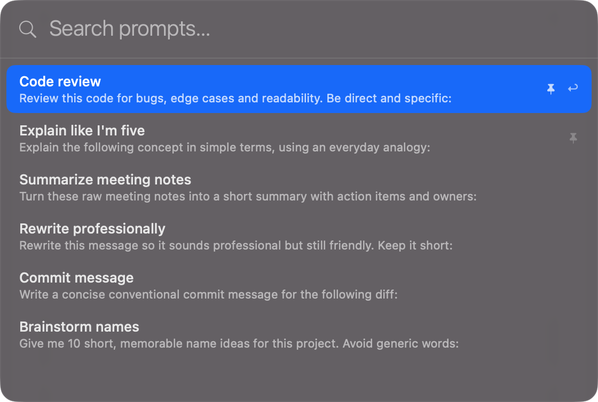
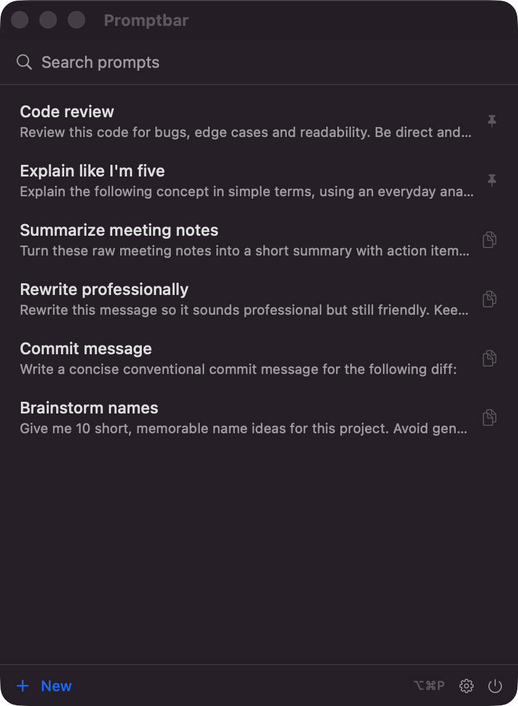

# Promptbar

A tiny macOS menu bar app that keeps your prompts one keystroke away. Native SwiftUI, no dependencies, and your data never leaves a local JSON file.

Hit <kbd>⌥⌘P</kbd> from any app, type a couple of letters, press return — the prompt is on your clipboard.



## What it does

- Lives in the menu bar. No Dock icon, no windows getting in your way.
- Spotlight-style quick panel on a global hotkey (<kbd>⌥⌘P</kbd> by default, configurable). Arrow keys to move, return to copy and dismiss, esc to close.
- Pin the prompts you use most so they always show up first.
- Search, create, edit and delete from the menu bar popover — or open it as a regular window if you prefer.
- Import and export your prompts as JSON.
- Launch at login, choose the menu bar icon, toggle text previews.

Prompts are stored in `~/Library/Application Support/Promptbar/prompts.json`. No accounts, no sync, no telemetry.



## Running it

Requires macOS 14 (Sonoma) or later. To build you need Swift 5.9+, which comes with Xcode or the Command Line Tools.

```bash
git clone https://github.com/manurrdd/promptbar.git
cd promptbar
swift run
```

The icon shows up in your menu bar.

## Installing it as an app

```bash
./make-app.sh
mv Promptbar.app /Applications
open /Applications/Promptbar.app
```

The bundle is ad-hoc signed, which is fine since you're building it yourself. Note that "Launch at login" only works when Promptbar runs as an installed app, not through `swift run`.

To quit, use the ⏻ button at the bottom of the menu bar popover.

## Code layout

Everything is plain SwiftUI/AppKit under `Sources/Promptbar/`. The interesting bits: `QuickPanel.swift` implements the floating panel as a non-activating `NSPanel`, so it can appear over any app without stealing focus, and `HotKey.swift` registers the global shortcut through Carbon, which still is the simplest way to get a system-wide hotkey without asking for accessibility permissions.

## License

[MIT](LICENSE)
